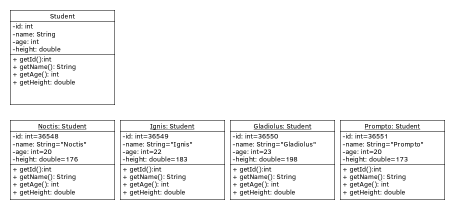

# ใบงานที่ 11 พื้นฐานการเขียนโปรแกรมเชิงวัตถุ

## โปรแกรมที่ 1

1.  เปิดไฟล์ชื่อ lab11_1.cpp
2.  สร้าง class  และ instance ตามรูป 
3.  ให้แสดงข้อมูล id, name, age, height ของแต่ละ instance ออกมาด้วยฟังก์ชัน

## โปรแกรมที่ 2

1.  ศึกษาข้อมูลการใช้ class String จาก <http://www.cplusplus.com/reference/string/string/>
2.  เขียนโปรแกรมโดยสร้าง instance จาก class String โดยมีข้อความเริ่มต้นคือ "There are two needles in this haystack with needles."
3.  เขียนโปรแกรมให้ทำงานได้ตามข้อกำหนดดังนี้
    -   หาความยาวของข้อความภายใน instance นั้นได้
    -   เพิ่มข้อความ "I Want to eat needle." ต่อท้ายข้อความเดิมของ instance นั้นได้
    -   ลบข้อความออกจำนวนครึ่งหนึ่งได้
    -   ค้นหาตำแหน่งข้อความ "needle" ได้
